# LUMO System Diagrams

This document contains visual diagrams for the LUMO architecture, database design, and workflows.

## Table of Contents
1. [System Architecture](#system-architecture)
2. [Database Entity-Relationship Diagram](#database-entity-relationship-diagram)
3. [API Sequence Diagrams](#api-sequence-diagrams)
4. [Component Architecture](#component-architecture)
5. [Data Flow Diagrams](#data-flow-diagrams)

---

## System Architecture

### Overall System Architecture

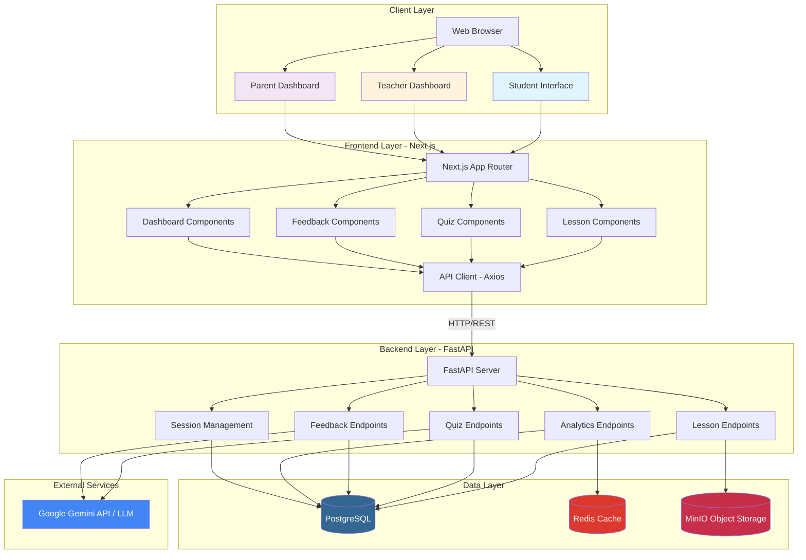
```mermaid
graph TB
    subgraph "Client Layer"
        Browser[Web Browser]
        Student[Student Interface]
        Teacher[Teacher Dashboard]
        Parent[Parent Dashboard]
    end

    subgraph "Frontend Layer - Next.js"
        NextJS[Next.js App Router]
        LessonUI[Lesson Components]
        QuizUI[Quiz Components]
        FeedbackUI[Feedback Components]
        DashboardUI[Dashboard Components]
        APIClient[API Client - Axios]
    end

    subgraph "Backend Layer - FastAPI"
        FastAPI[FastAPI Server]
        LessonAPI[Lesson Endpoints]
        QuizAPI[Quiz Endpoints]
        FeedbackAPI[Feedback Endpoints]
        AnalyticsAPI[Analytics Endpoints]
        SessionAPI[Session Management]
    end

    subgraph "Data Layer"
        PostgreSQL[(PostgreSQL)]
        Redis[(Redis Cache)]
        MinIO[(MinIO Object Storage)]
    end

    subgraph "External Services"
        Gemini[Google Gemini API / LLM]
    end

    Browser --> Student
    Browser --> Teacher
    Browser --> Parent
    Student --> NextJS
    Teacher --> NextJS
    Parent --> NextJS
    
    NextJS --> LessonUI
    NextJS --> QuizUI
    NextJS --> FeedbackUI
    NextJS --> DashboardUI
    
    LessonUI --> APIClient
    QuizUI --> APIClient
    FeedbackUI --> APIClient
    DashboardUI --> APIClient
    
    APIClient -->|HTTP/REST| FastAPI
    
    FastAPI --> LessonAPI
    FastAPI --> QuizAPI
    FastAPI --> FeedbackAPI
    FastAPI --> AnalyticsAPI
    FastAPI --> SessionAPI
    
    LessonAPI --> PostgreSQL
    QuizAPI --> PostgreSQL
    FeedbackAPI --> PostgreSQL
    AnalyticsAPI --> PostgreSQL
    SessionAPI --> PostgreSQL
    
    QuizAPI --> Gemini
    FeedbackAPI --> Gemini
    
    LessonAPI --> MinIO
    AnalyticsAPI --> Redis
    
    style Student fill:#e1f5ff
    style Teacher fill:#fff3e0
    style Parent fill:#f3e5f5
    style PostgreSQL fill:#336791,color:#fff
    style Redis fill:#dc382d,color:#fff
    style MinIO fill:#c72e49,color:#fff
    style Gemini fill:#4285f4,color:#fff
```

### Multi-Agent Architecture

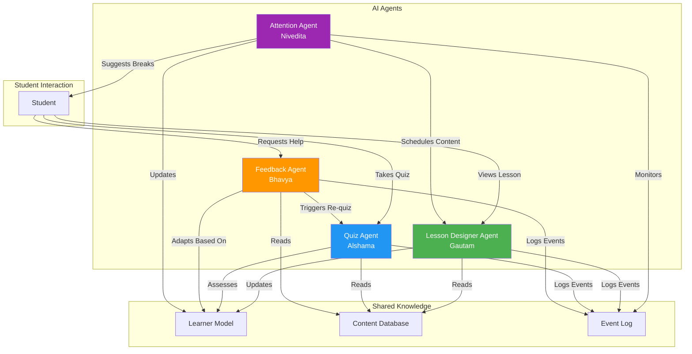
```mermaid
graph TB
    subgraph "Student Interaction"
        Student[Student]
    end

    subgraph "AI Agents"
        LessonAgent[Lesson Designer Agent<br/>Gautam]
        QuizAgent[Quiz Agent<br/>Alshama]
        FeedbackAgent[Feedback Agent<br/>Bhavya]
        AttentionAgent[Attention Agent<br/>Nivedita]
    end

    subgraph "Shared Knowledge"
        LearnerModel[Learner Model]
        ContentDB[Content Database]
        EventLog[Event Log]
    end

    Student -->|Views Lesson| LessonAgent
    Student -->|Takes Quiz| QuizAgent
    Student -->|Requests Help| FeedbackAgent
    
    LessonAgent -->|Updates| LearnerModel
    QuizAgent -->|Assesses| LearnerModel
    FeedbackAgent -->|Adapts Based On| LearnerModel
    AttentionAgent -->|Monitors| EventLog
    AttentionAgent -->|Updates| LearnerModel
    
    LessonAgent -->|Reads| ContentDB
    QuizAgent -->|Reads| ContentDB
    FeedbackAgent -->|Reads| ContentDB
    
    LessonAgent -->|Logs Events| EventLog
    QuizAgent -->|Logs Events| EventLog
    FeedbackAgent -->|Logs Events| EventLog
    
    AttentionAgent -->|Suggests Breaks| Student
    AttentionAgent -->|Schedules Content| LessonAgent
    FeedbackAgent -->|Triggers Re-quiz| QuizAgent
    
    style LessonAgent fill:#4CAF50,color:#fff
    style QuizAgent fill:#2196F3,color:#fff
    style FeedbackAgent fill:#FF9800,color:#fff
    style AttentionAgent fill:#9C27B0,color:#fff
```

---

## Database Entity-Relationship Diagram

### Complete Database Schema

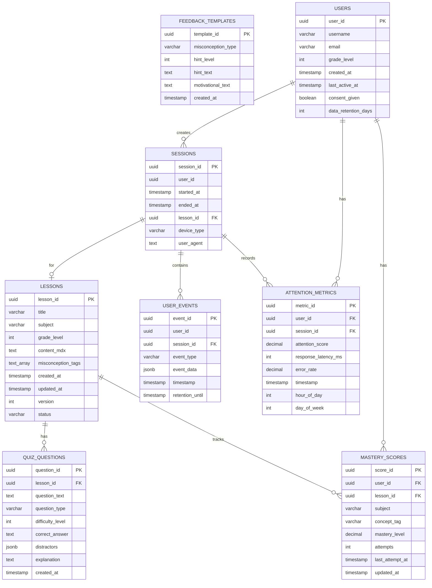
```mermaid
erDiagram
    %% Content Schema
    LESSONS ||--o{ QUIZ_QUESTIONS : "has"
    LESSONS {
        uuid lesson_id PK
        varchar title
        varchar subject
        int grade_level
        text content_mdx
        text_array misconception_tags
        timestamp created_at
        timestamp updated_at
        int version
        varchar status
    }

    QUIZ_QUESTIONS {
        uuid question_id PK
        uuid lesson_id FK
        text question_text
        varchar question_type
        int difficulty_level
        text correct_answer
        jsonb distractors
        text explanation
        timestamp created_at
    }

    FEEDBACK_TEMPLATES {
        uuid template_id PK
        varchar misconception_type
        int hint_level
        text hint_text
        text motivational_text
        timestamp created_at
    }

    %% Events Schema
    SESSIONS ||--o{ USER_EVENTS : "contains"
    SESSIONS ||--o| LESSONS : "for"
    
    USER_EVENTS {
        uuid event_id PK
        uuid user_id
        uuid session_id FK
        varchar event_type
        jsonb event_data
        timestamp timestamp
        timestamp retention_until
    }

    SESSIONS {
        uuid session_id PK
        uuid user_id
        timestamp started_at
        timestamp ended_at
        uuid lesson_id FK
        varchar device_type
        text user_agent
    }

    %% Learner Schema
    USERS ||--o{ MASTERY_SCORES : "has"
    USERS ||--o{ ATTENTION_METRICS : "has"
    USERS ||--o{ SESSIONS : "creates"
    
    USERS {
        uuid user_id PK
        varchar username
        varchar email
        int grade_level
        timestamp created_at
        timestamp last_active_at
        boolean consent_given
        int data_retention_days
    }

    LESSONS ||--o{ MASTERY_SCORES : "tracks"
    
    MASTERY_SCORES {
        uuid score_id PK
        uuid user_id FK
        uuid lesson_id FK
        varchar subject
        varchar concept_tag
        decimal mastery_level
        int attempts
        timestamp last_attempt_at
        timestamp updated_at
    }

    SESSIONS ||--o{ ATTENTION_METRICS : "records"
    
    ATTENTION_METRICS {
        uuid metric_id PK
        uuid user_id FK
        uuid session_id FK
        decimal attention_score
        int response_latency_ms
        decimal error_rate
        timestamp timestamp
        int hour_of_day
        int day_of_week
    }
```

### Schema Organization

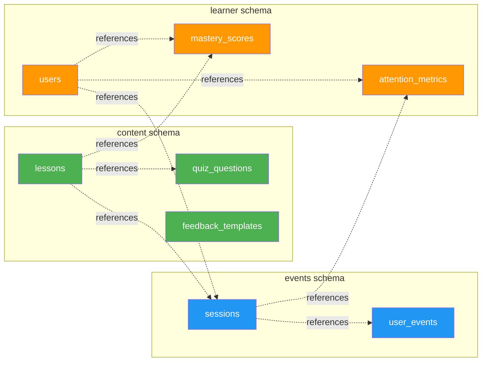
```mermaid
graph LR
    subgraph "content schema"
        L[lessons]
        Q[quiz_questions]
        F[feedback_templates]
    end
    
    subgraph "events schema"
        E[user_events]
        S[sessions]
    end
    
    subgraph "learner schema"
        U[users]
        M[mastery_scores]
        A[attention_metrics]
    end
    
    L -.->|references| M
    L -.->|references| Q
    L -.->|references| S
    U -.->|references| M
    U -.->|references| A
    U -.->|references| S
    S -.->|references| E
    S -.->|references| A
    
    style L fill:#4CAF50,color:#fff
    style Q fill:#4CAF50,color:#fff
    style F fill:#4CAF50,color:#fff
    style E fill:#2196F3,color:#fff
    style S fill:#2196F3,color:#fff
    style U fill:#FF9800,color:#fff
    style M fill:#FF9800,color:#fff
    style A fill:#FF9800,color:#fff
```

---

## API Sequence Diagrams

### Lesson Viewing Workflow

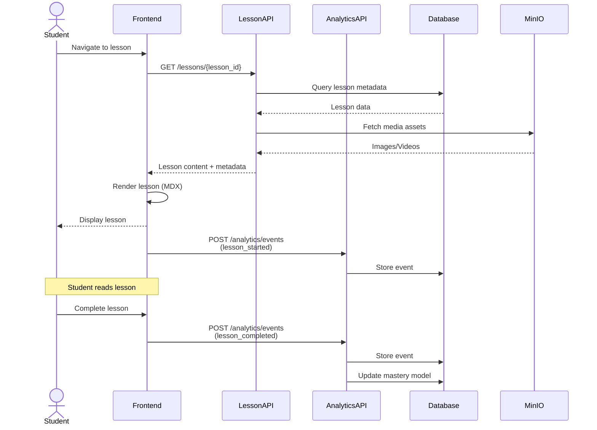
```mermaid
sequenceDiagram
    actor Student
    participant Frontend
    participant LessonAPI
    participant AnalyticsAPI
    participant Database
    participant MinIO

    Student->>Frontend: Navigate to lesson
    Frontend->>LessonAPI: GET /lessons/{lesson_id}
    LessonAPI->>Database: Query lesson metadata
    Database-->>LessonAPI: Lesson data
    LessonAPI->>MinIO: Fetch media assets
    MinIO-->>LessonAPI: Images/Videos
    LessonAPI-->>Frontend: Lesson content + metadata
    
    Frontend->>Frontend: Render lesson (MDX)
    Frontend-->>Student: Display lesson
    
    Frontend->>AnalyticsAPI: POST /analytics/events<br/>(lesson_started)
    AnalyticsAPI->>Database: Store event
    
    Note over Student,Frontend: Student reads lesson
    
    Student->>Frontend: Complete lesson
    Frontend->>AnalyticsAPI: POST /analytics/events<br/>(lesson_completed)
    AnalyticsAPI->>Database: Store event
    AnalyticsAPI->>Database: Update mastery model
```

### Quiz Taking Workflow

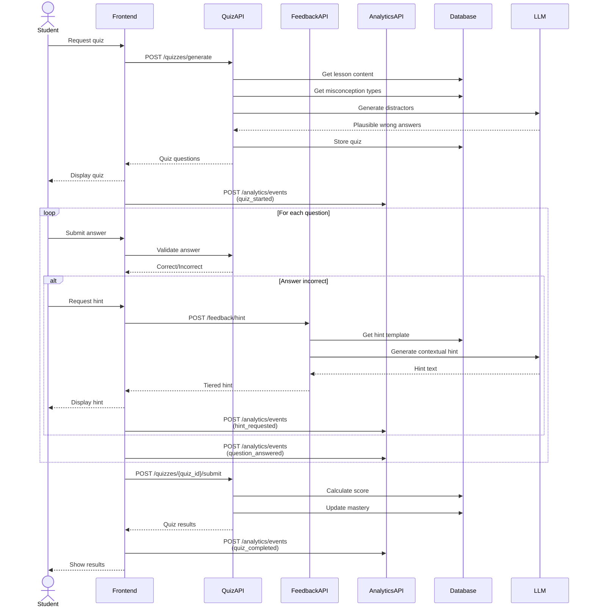
```mermaid
sequenceDiagram
    actor Student
    participant Frontend
    participant QuizAPI
    participant FeedbackAPI
    participant AnalyticsAPI
    participant Database
    participant LLM

    Student->>Frontend: Request quiz
    Frontend->>QuizAPI: POST /quizzes/generate
    QuizAPI->>Database: Get lesson content
    QuizAPI->>Database: Get misconception types
    QuizAPI->>LLM: Generate distractors
    LLM-->>QuizAPI: Plausible wrong answers
    QuizAPI->>Database: Store quiz
    QuizAPI-->>Frontend: Quiz questions
    
    Frontend-->>Student: Display quiz
    Frontend->>AnalyticsAPI: POST /analytics/events<br/>(quiz_started)
    
    loop For each question
        Student->>Frontend: Submit answer
        Frontend->>QuizAPI: Validate answer
        QuizAPI-->>Frontend: Correct/Incorrect
        
        alt Answer incorrect
            Student->>Frontend: Request hint
            Frontend->>FeedbackAPI: POST /feedback/hint
            FeedbackAPI->>Database: Get hint template
            FeedbackAPI->>LLM: Generate contextual hint
            LLM-->>FeedbackAPI: Hint text
            FeedbackAPI-->>Frontend: Tiered hint
            Frontend-->>Student: Display hint
            
            Frontend->>AnalyticsAPI: POST /analytics/events<br/>(hint_requested)
        end
        
        Frontend->>AnalyticsAPI: POST /analytics/events<br/>(question_answered)
    end
    
    Frontend->>QuizAPI: POST /quizzes/{quiz_id}/submit
    QuizAPI->>Database: Calculate score
    QuizAPI->>Database: Update mastery
    QuizAPI-->>Frontend: Quiz results
    
    Frontend->>AnalyticsAPI: POST /analytics/events<br/>(quiz_completed)
    Frontend-->>Student: Show results
```

### Attention Monitoring Workflow

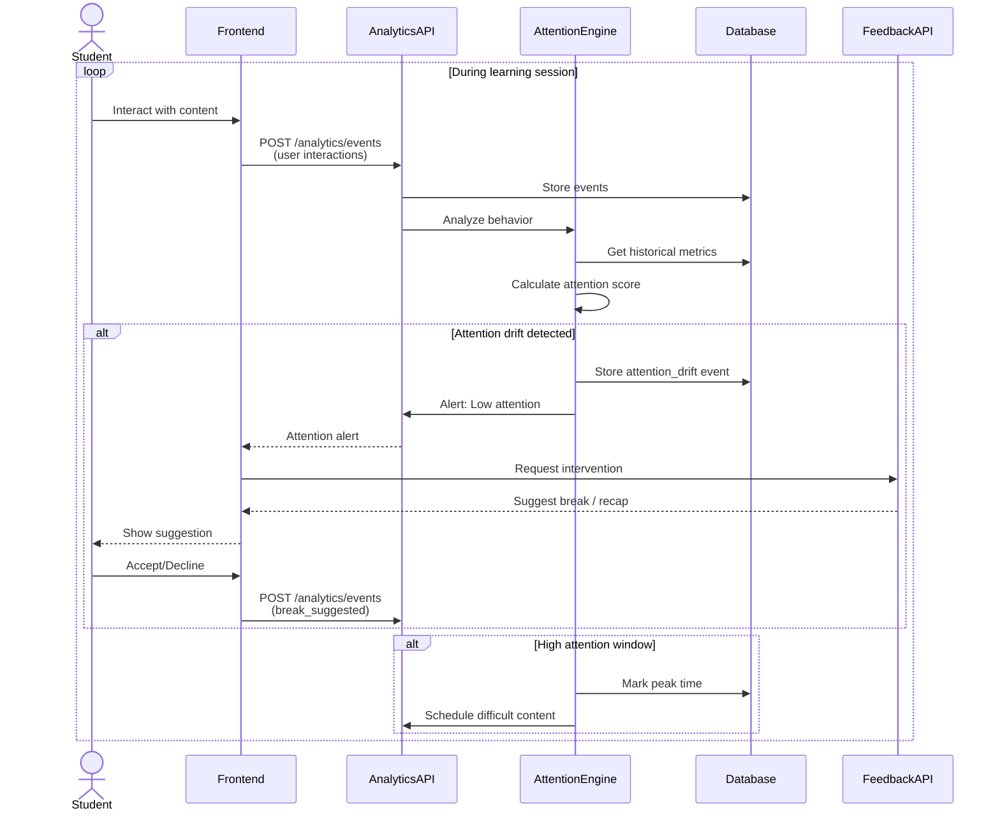
```mermaid
sequenceDiagram
    actor Student
    participant Frontend
    participant AnalyticsAPI
    participant AttentionEngine
    participant Database
    participant FeedbackAPI

    loop During learning session
        Student->>Frontend: Interact with content
        Frontend->>AnalyticsAPI: POST /analytics/events<br/>(user interactions)
        AnalyticsAPI->>Database: Store events
        
        AnalyticsAPI->>AttentionEngine: Analyze behavior
        AttentionEngine->>Database: Get historical metrics
        AttentionEngine->>AttentionEngine: Calculate attention score
        
        alt Attention drift detected
            AttentionEngine->>Database: Store attention_drift event
            AttentionEngine->>AnalyticsAPI: Alert: Low attention
            AnalyticsAPI-->>Frontend: Attention alert
            
            Frontend->>FeedbackAPI: Request intervention
            FeedbackAPI-->>Frontend: Suggest break / recap
            Frontend-->>Student: Show suggestion
            
            Student->>Frontend: Accept/Decline
            Frontend->>AnalyticsAPI: POST /analytics/events<br/>(break_suggested)
        end
        
        alt High attention window
            AttentionEngine->>Database: Mark peak time
            AttentionEngine->>AnalyticsAPI: Schedule difficult content
        end
    end
```

### Dashboard Data Retrieval

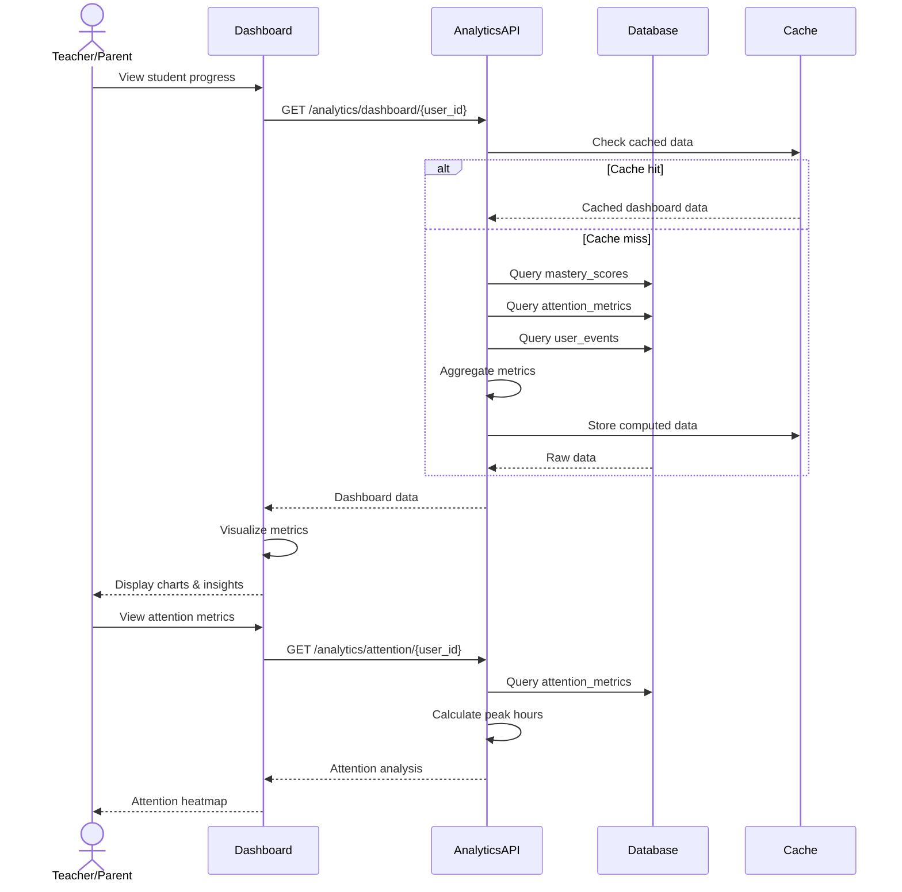
```mermaid
sequenceDiagram
    actor Teacher/Parent
    participant Dashboard
    participant AnalyticsAPI
    participant Database
    participant Cache

    Teacher/Parent->>Dashboard: View student progress
    Dashboard->>AnalyticsAPI: GET /analytics/dashboard/{user_id}
    
    AnalyticsAPI->>Cache: Check cached data
    
    alt Cache hit
        Cache-->>AnalyticsAPI: Cached dashboard data
    else Cache miss
        AnalyticsAPI->>Database: Query mastery_scores
        AnalyticsAPI->>Database: Query attention_metrics
        AnalyticsAPI->>Database: Query user_events
        AnalyticsAPI->>AnalyticsAPI: Aggregate metrics
        AnalyticsAPI->>Cache: Store computed data
        Database-->>AnalyticsAPI: Raw data
    end
    
    AnalyticsAPI-->>Dashboard: Dashboard data
    Dashboard->>Dashboard: Visualize metrics
    Dashboard-->>Teacher/Parent: Display charts & insights
    
    Teacher/Parent->>Dashboard: View attention metrics
    Dashboard->>AnalyticsAPI: GET /analytics/attention/{user_id}
    AnalyticsAPI->>Database: Query attention_metrics
    AnalyticsAPI->>AnalyticsAPI: Calculate peak hours
    AnalyticsAPI-->>Dashboard: Attention analysis
    Dashboard-->>Teacher/Parent: Attention heatmap
```

---

## Component Architecture

### Backend Component Structure

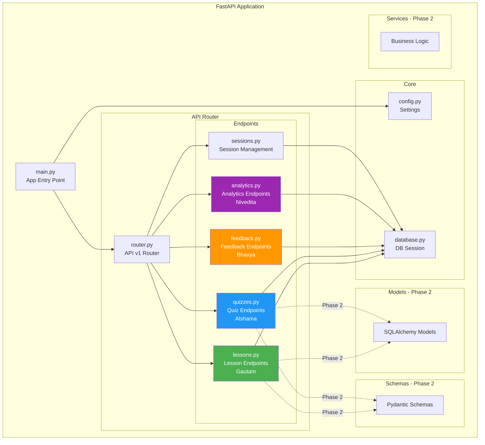
```mermaid
graph TB
    subgraph "FastAPI Application"
        Main[main.py<br/>App Entry Point]
        
        subgraph "Core"
            Config[config.py<br/>Settings]
            Database[database.py<br/>DB Session]
        end
        
        subgraph "API Router"
            Router[router.py<br/>API v1 Router]
            
            subgraph "Endpoints"
                Lessons[lessons.py<br/>Lesson Endpoints<br/>Gautam]
                Quizzes[quizzes.py<br/>Quiz Endpoints<br/>Alshama]
                Feedback[feedback.py<br/>Feedback Endpoints<br/>Bhavya]
                Analytics[analytics.py<br/>Analytics Endpoints<br/>Nivedita]
                Sessions[sessions.py<br/>Session Management]
            end
        end
        
        subgraph "Models - Phase 2"
            DBModels[SQLAlchemy Models]
        end
        
        subgraph "Schemas - Phase 2"
            Pydantic[Pydantic Schemas]
        end
        
        subgraph "Services - Phase 2"
            Business[Business Logic]
        end
    end
    
    Main --> Config
    Main --> Router
    Router --> Lessons
    Router --> Quizzes
    Router --> Feedback
    Router --> Analytics
    Router --> Sessions
    
    Lessons --> Database
    Quizzes --> Database
    Feedback --> Database
    Analytics --> Database
    Sessions --> Database
    
    Lessons -.->|Phase 2| DBModels
    Quizzes -.->|Phase 2| DBModels
    
    Lessons -.->|Phase 2| Pydantic
    Quizzes -.->|Phase 2| Pydantic
    
    style Lessons fill:#4CAF50,color:#fff
    style Quizzes fill:#2196F3,color:#fff
    style Feedback fill:#FF9800,color:#fff
    style Analytics fill:#9C27B0,color:#fff
```

### Frontend Component Structure

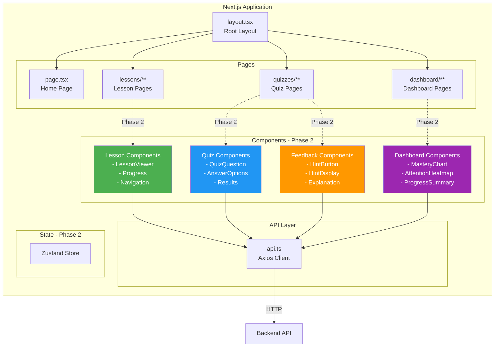
```mermaid
graph TB
    subgraph "Next.js Application"
        Layout[layout.tsx<br/>Root Layout]
        
        subgraph "Pages"
            Home[page.tsx<br/>Home Page]
            LessonPages[lessons/**<br/>Lesson Pages]
            QuizPages[quizzes/**<br/>Quiz Pages]
            DashboardPages[dashboard/**<br/>Dashboard Pages]
        end
        
        subgraph "Components - Phase 2"
            LessonComps[Lesson Components<br/>- LessonViewer<br/>- Progress<br/>- Navigation]
            QuizComps[Quiz Components<br/>- QuizQuestion<br/>- AnswerOptions<br/>- Results]
            FeedbackComps[Feedback Components<br/>- HintButton<br/>- HintDisplay<br/>- Explanation]
            DashboardComps[Dashboard Components<br/>- MasteryChart<br/>- AttentionHeatmap<br/>- ProgressSummary]
        end
        
        subgraph "API Layer"
            APIClient[api.ts<br/>Axios Client]
        end
        
        subgraph "State - Phase 2"
            Zustand[Zustand Store]
        end
    end
    
    Layout --> Home
    Layout --> LessonPages
    Layout --> QuizPages
    Layout --> DashboardPages
    
    LessonPages -.->|Phase 2| LessonComps
    QuizPages -.->|Phase 2| QuizComps
    QuizPages -.->|Phase 2| FeedbackComps
    DashboardPages -.->|Phase 2| DashboardComps
    
    LessonComps --> APIClient
    QuizComps --> APIClient
    FeedbackComps --> APIClient
    DashboardComps --> APIClient
    
    APIClient -->|HTTP| Backend[Backend API]
    
    style LessonComps fill:#4CAF50,color:#fff
    style QuizComps fill:#2196F3,color:#fff
    style FeedbackComps fill:#FF9800,color:#fff
    style DashboardComps fill:#9C27B0,color:#fff
```

---

## Data Flow Diagrams

### Event Data Flow

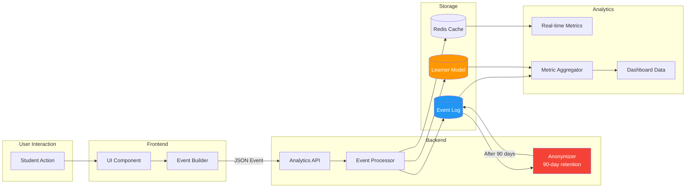
```mermaid
flowchart LR
    subgraph "User Interaction"
        Student[Student Action]
    end
    
    subgraph "Frontend"
        UI[UI Component]
        EventBuilder[Event Builder]
    end
    
    subgraph "Backend"
        EventAPI[Analytics API]
        EventProcessor[Event Processor]
        Anonymizer[Anonymizer<br/>90-day retention]
    end
    
    subgraph "Storage"
        EventLog[(Event Log)]
        LearnerModel[(Learner Model)]
        Cache[(Redis Cache)]
    end
    
    subgraph "Analytics"
        RealTime[Real-time Metrics]
        Aggregator[Metric Aggregator]
        Dashboard[Dashboard Data]
    end
    
    Student --> UI
    UI --> EventBuilder
    EventBuilder -->|JSON Event| EventAPI
    EventAPI --> EventProcessor
    
    EventProcessor --> EventLog
    EventProcessor --> LearnerModel
    EventProcessor --> Cache
    
    EventLog --> Anonymizer
    Anonymizer -->|After 90 days| EventLog
    
    Cache --> RealTime
    EventLog --> Aggregator
    LearnerModel --> Aggregator
    Aggregator --> Dashboard
    
    style EventLog fill:#2196F3,color:#fff
    style LearnerModel fill:#FF9800,color:#fff
    style Anonymizer fill:#f44336,color:#fff
```

### Lesson Content Flow

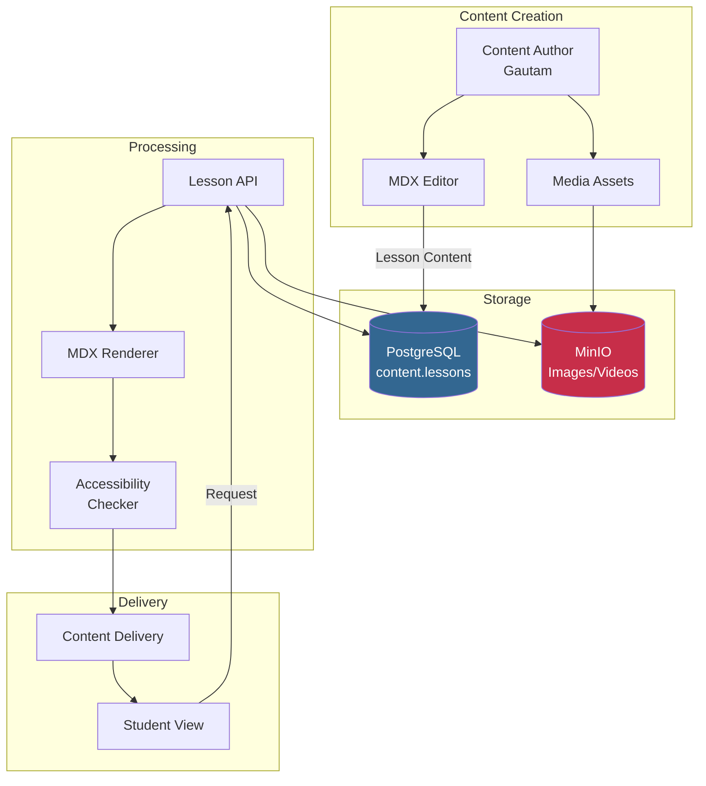
```mermaid
flowchart TB
    subgraph "Content Creation"
        Author[Content Author<br/>Gautam]
        MDX[MDX Editor]
        Media[Media Assets]
    end
    
    subgraph "Storage"
        DB[(PostgreSQL<br/>content.lessons)]
        MinIO[(MinIO<br/>Images/Videos)]
    end
    
    subgraph "Processing"
        API[Lesson API]
        Renderer[MDX Renderer]
        Accessibility[Accessibility<br/>Checker]
    end
    
    subgraph "Delivery"
        CDN[Content Delivery]
        Student[Student View]
    end
    
    Author --> MDX
    Author --> Media
    
    MDX -->|Lesson Content| DB
    Media --> MinIO
    
    Student -->|Request| API
    API --> DB
    API --> MinIO
    API --> Renderer
    Renderer --> Accessibility
    
    Accessibility --> CDN
    CDN --> Student
    
    style DB fill:#336791,color:#fff
    style MinIO fill:#c72e49,color:#fff
```

### Quiz Generation Flow

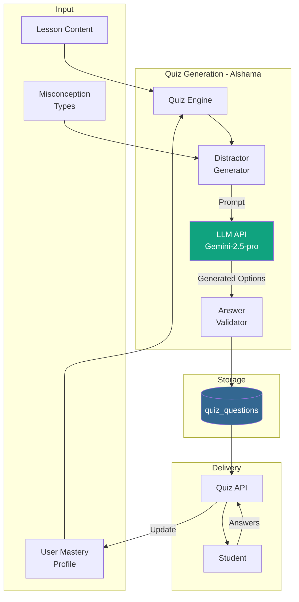
```mermaid
flowchart TB
    subgraph "Input"
        Lesson[Lesson Content]
        Misconceptions[Misconception<br/>Types]
        UserProfile[User Mastery<br/>Profile]
    end
    
    subgraph "Quiz Generation - Alshama"
        QuizEngine[Quiz Engine]
        DistractorGen[Distractor<br/>Generator]
        LLM[LLM API<br/>Gemini-2.5-pro]
        Validator[Answer<br/>Validator]
    end
    
    subgraph "Storage"
        QuizDB[(quiz_questions)]
    end
    
    subgraph "Delivery"
        QuizAPI[Quiz API]
        Student[Student]
    end
    
    Lesson --> QuizEngine
    Misconceptions --> DistractorGen
    UserProfile --> QuizEngine
    
    QuizEngine --> DistractorGen
    DistractorGen -->|Prompt| LLM
    LLM -->|Generated Options| Validator
    Validator --> QuizDB
    
    QuizDB --> QuizAPI
    QuizAPI --> Student
    
    Student -->|Answers| QuizAPI
    QuizAPI -->|Update| UserProfile
    
    style LLM fill:#10a37f,color:#fff
    style QuizDB fill:#336791,color:#fff
```

### Feedback Loop Flow

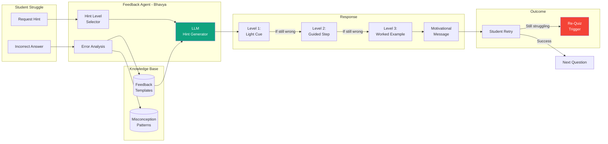
```mermaid
flowchart LR
    subgraph "Student Struggle"
        Wrong[Incorrect Answer]
        Request[Request Hint]
    end
    
    subgraph "Feedback Agent - Bhavya"
        Error[Error Analysis]
        HintLevel[Hint Level<br/>Selector]
        LLM[LLM<br/>Hint Generator]
    end
    
    subgraph "Knowledge Base"
        Templates[(Feedback<br/>Templates)]
        Misconceptions[(Misconception<br/>Patterns)]
    end
    
    subgraph "Response"
        Hint1[Level 1:<br/>Light Cue]
        Hint2[Level 2:<br/>Guided Step]
        Hint3[Level 3:<br/>Worked Example]
        Motivation[Motivational<br/>Message]
    end
    
    subgraph "Outcome"
        Retry[Student Retry]
        ReQuiz[Re-Quiz<br/>Trigger]
    end
    
    Wrong --> Error
    Request --> HintLevel
    
    Error --> Templates
    Error --> Misconceptions
    HintLevel --> LLM
    Templates --> LLM
    
    LLM --> Hint1
    Hint1 -->|If still wrong| Hint2
    Hint2 -->|If still wrong| Hint3
    Hint3 --> Motivation
    
    Motivation --> Retry
    Retry -->|Success| Next[Next Question]
    Retry -->|Still struggling| ReQuiz
    
    style LLM fill:#10a37f,color:#fff
    style ReQuiz fill:#f44336,color:#fff
```

---

## Deployment Architecture

### Development Environment

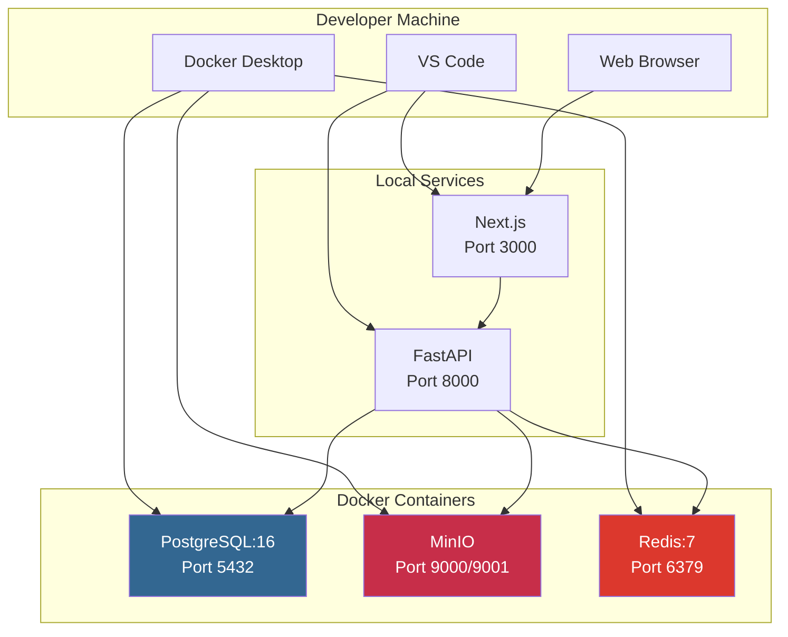
```mermaid
graph TB
    subgraph "Developer Machine"
        IDE[VS Code]
        DockerDesktop[Docker Desktop]
        Browser[Web Browser]
    end
    
    subgraph "Docker Containers"
        Postgres[PostgreSQL:16<br/>Port 5432]
        MinIO[MinIO<br/>Port 9000/9001]
        Redis[Redis:7<br/>Port 6379]
    end
    
    subgraph "Local Services"
        Backend[FastAPI<br/>Port 8000]
        Frontend[Next.js<br/>Port 3000]
    end
    
    IDE --> Backend
    IDE --> Frontend
    DockerDesktop --> Postgres
    DockerDesktop --> MinIO
    DockerDesktop --> Redis
    
    Backend --> Postgres
    Backend --> MinIO
    Backend --> Redis
    
    Frontend --> Backend
    Browser --> Frontend
    
    style Postgres fill:#336791,color:#fff
    style MinIO fill:#c72e49,color:#fff
    style Redis fill:#dc382d,color:#fff
```

### Production Architecture (Planned)

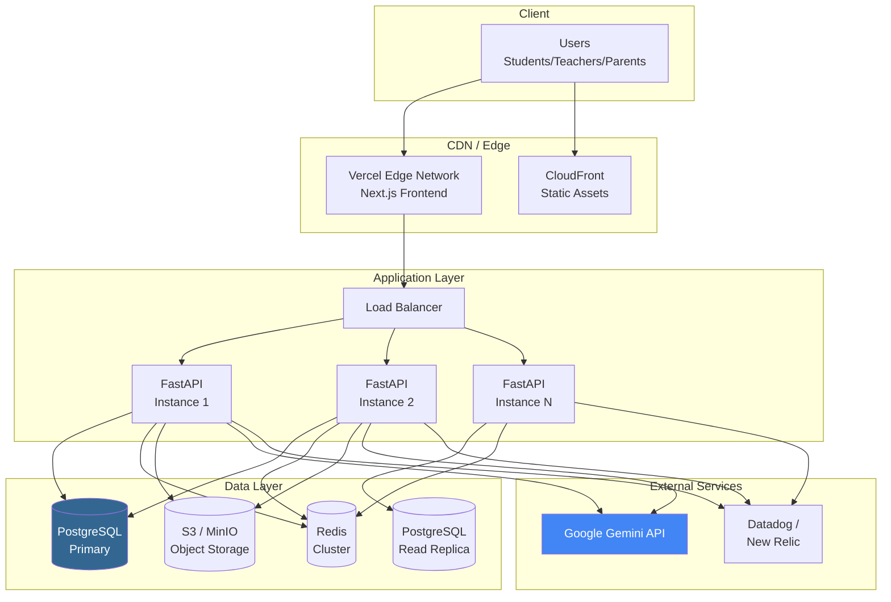
```mermaid
graph TB
    subgraph "Client"
        Users[Users<br/>Students/Teachers/Parents]
    end
    
    subgraph "CDN / Edge"
        Vercel[Vercel Edge Network<br/>Next.js Frontend]
        CloudFront[CloudFront<br/>Static Assets]
    end
    
    subgraph "Application Layer"
        LB[Load Balancer]
        API1[FastAPI<br/>Instance 1]
        API2[FastAPI<br/>Instance 2]
        API3[FastAPI<br/>Instance N]
    end
    
    subgraph "Data Layer"
        PrimaryDB[(PostgreSQL<br/>Primary)]
        ReplicaDB[(PostgreSQL<br/>Read Replica)]
        RedisCluster[(Redis<br/>Cluster)]
        S3[(S3 / MinIO<br/>Object Storage)]
    end
    
    subgraph "External Services"
        Gemini[Google Gemini API]
        Monitoring[Datadog /<br/>New Relic]
    end
    
    Users --> Vercel
    Users --> CloudFront
    Vercel --> LB
    
    LB --> API1
    LB --> API2
    LB --> API3
    
    API1 --> PrimaryDB
    API2 --> PrimaryDB
    API3 --> ReplicaDB
    
    API1 --> RedisCluster
    API2 --> RedisCluster
    API3 --> RedisCluster
    
    API1 --> S3
    API2 --> S3
    
    API1 --> Gemini
    API2 --> Gemini
    
    API1 --> Monitoring
    API2 --> Monitoring
    API3 --> Monitoring
    
    style PrimaryDB fill:#336791,color:#fff
    style Gemini fill:#4285f4,color:#fff
```

---

## Privacy and Data Flow

### Data Privacy Architecture

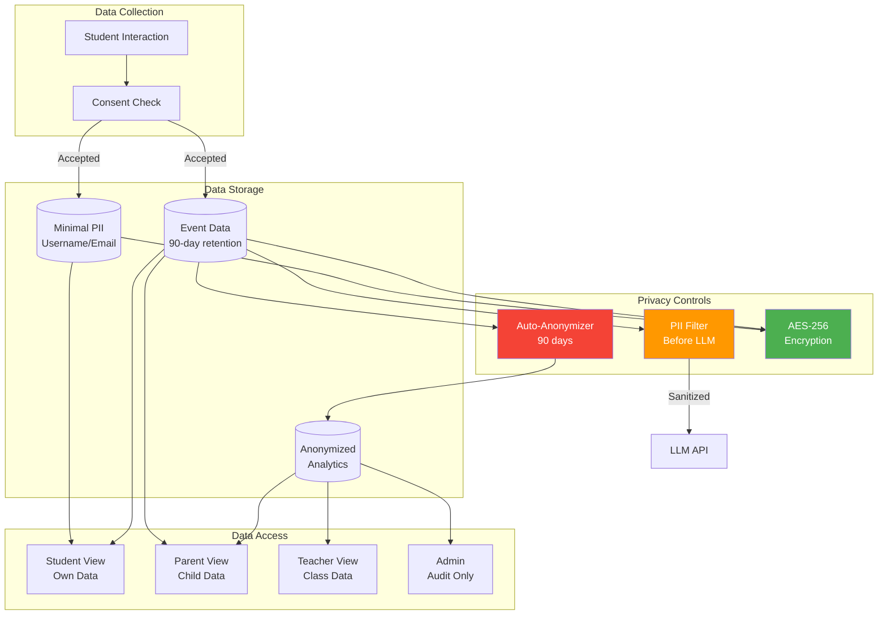
```mermaid
flowchart TB
    subgraph "Data Collection"
        Student[Student Interaction]
        Consent[Consent Check]
    end
    
    subgraph "Data Storage"
        PII[(Minimal PII<br/>Username/Email)]
        Events[(Event Data<br/>90-day retention)]
        Aggregated[(Anonymized<br/>Analytics)]
    end
    
    subgraph "Privacy Controls"
        Anonymizer[Auto-Anonymizer<br/>90 days]
        Filter[PII Filter<br/>Before LLM]
        Encryption[AES-256<br/>Encryption]
    end
    
    subgraph "Data Access"
        Student2[Student View<br/>Own Data]
        Parent[Parent View<br/>Child Data]
        Teacher[Teacher View<br/>Class Data]
        Admin[Admin<br/>Audit Only]
    end
    
    Student --> Consent
    Consent -->|Accepted| Events
    Consent -->|Accepted| PII
    
    Events --> Anonymizer
    Anonymizer --> Aggregated
    
    PII --> Encryption
    Events --> Encryption
    
    Events --> Filter
    Filter -->|Sanitized| LLM[LLM API]
    
    PII --> Student2
    Events --> Student2
    
    Events --> Parent
    Aggregated --> Parent
    
    Aggregated --> Teacher
    
    Aggregated --> Admin
    
    style Anonymizer fill:#f44336,color:#fff
    style Filter fill:#ff9800,color:#fff
    style Encryption fill:#4CAF50,color:#fff
```

---

## Notes

- All diagrams use **Mermaid** syntax and can be rendered in:
  - GitHub Markdown
  - GitLab
  - VS Code with Mermaid extensions
  - Documentation tools (Docusaurus, MkDocs, etc.)
  
- Diagrams are organized by:
  - **System Architecture**: Overall system design
  - **Database ER**: Data model relationships
  - **Sequence Diagrams**: Interaction workflows
  - **Component Diagrams**: Code organization
  - **Data Flow**: Information flow through system

- Color coding:
  - 🟢 Green: Lesson/Content components (Gautam)
  - 🔵 Blue: Quiz components (Alshama)
  - 🟠 Orange: Feedback components (Bhavya)
  - 🟣 Purple: Analytics/Attention components (Nivedita)

---

**Last Updated**: October 21, 2025  
**Maintained by**: LUMO Development Team

For editable versions or to generate PNG/SVG exports, use:
- [Mermaid Live Editor](https://mermaid.live/)
- VS Code Mermaid Preview extension
- GitHub's built-in Mermaid rendering

