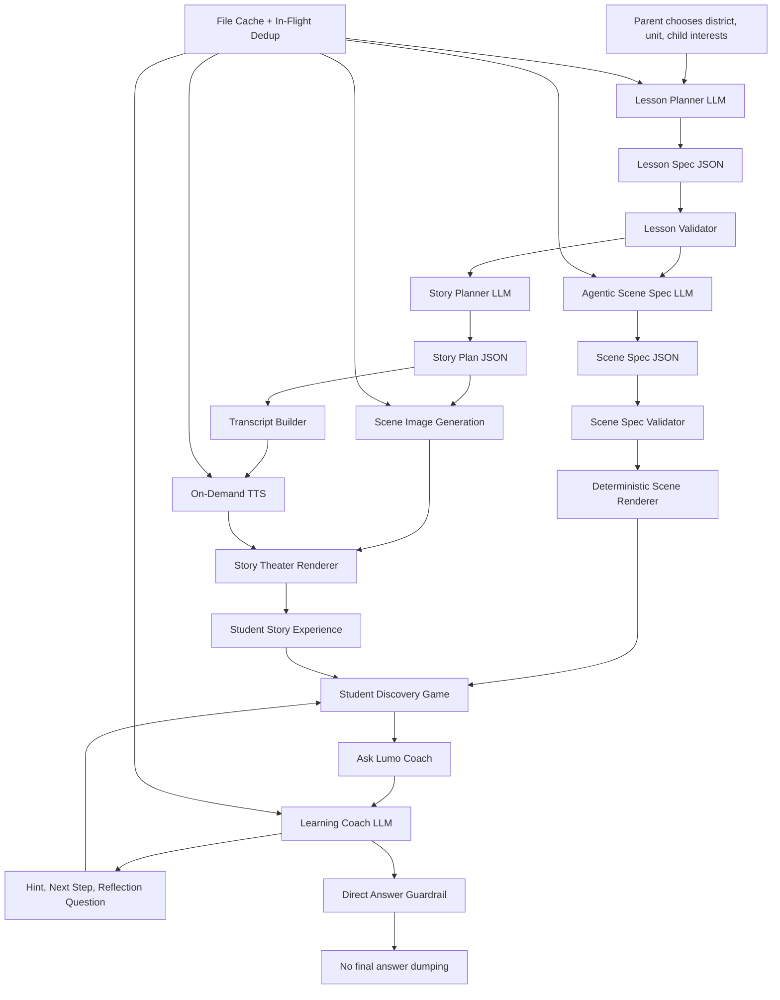

# Agentic Lesson POC Workflow

## Executive Summary

This POC uses a **controlled agentic pipeline**:

1. AI plans the lesson
2. AI generates a **scene spec** for the discovery game
3. The app validates every structured output
4. Trusted renderers turn specs into child-safe UI
5. AI helps with coaching, but does **not** give final answers

This is closer to an **A2UI-style architecture** than raw prompt-to-UI generation, but it remains deterministic and demo-safe.

## Workflow Diagram

## Why This Matters

- The **lesson planner** decides what should be taught.
- The **scene-spec generator** decides how the discovery game should be structured.
- The **renderer does not trust raw model output blindly**. It only renders validated structured specs.
- The **coach agent** supports thinking, not answer copying.
- The **cache layer** reduces cost and makes demos repeatable.

## Value Proposition For A Technical Audience

- More innovative than fixed educational content because the experience is dynamically composed.
- Safer than fully freeform prompt-to-UI generation because the runtime only accepts validated schemas.
- More pedagogically defensible than answer-generation tools because the coach is constrained to Socratic guidance.
- More practical than full Unity/Godot pipelines for a short POC because it preserves web delivery speed and iteration velocity.

## Honest Positioning

- This is **not** literally Google A2UI.
- It **is** an A2UI-like pattern:
  - model produces structured UI/game intent
  - schema validates that intent
  - runtime renderer instantiates the experience

## Demo Talking Line

“Instead of asking the model to directly write arbitrary UI code, we let the model produce structured educational scene specifications, validate them, and then render them through trusted components. That gives us adaptive, agentic behavior without losing safety or control.”
